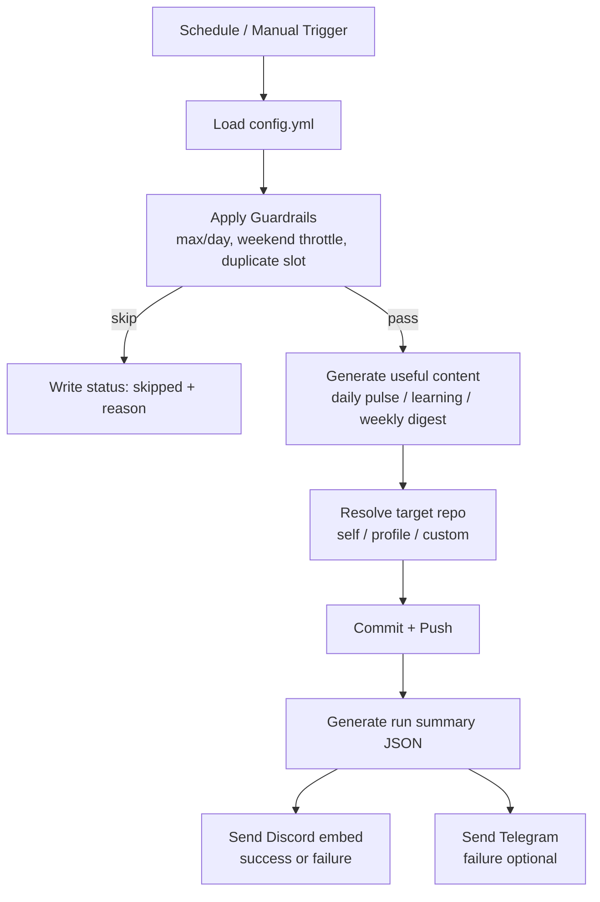
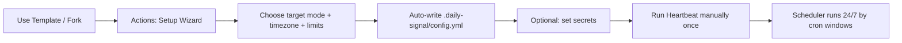

<h1 align="center">daily-signal</h1>

<strong>Reusable GitHub Actions template</strong> for meaningful contribution signals (not dummy commits).

  
  
  
  

---

## ✨ Why this exists

`daily-signal` keeps your contribution flow active with **useful logs**:
- Daily engineering pulse
- Learning notes
- Weekly digest
- Health metadata

No random spam text. Everything is structured and auditable.

---

## 🧭 System Flow (How it works)

---

## ⚙️ Setup Flow (for users who fork/template)

---

## 🚀 Quick Start

1. Click **Use this template**.
2. Go to **Actions → Setup Wizard → Run workflow**.
3. Choose configuration:
   - `target_mode`: `self | profile | custom`
   - timezone
   - commits/day policy
4. Optional secrets:
   - `DISCORD_WEBHOOK_URL` (success+failure embed)
   - `TELEGRAM_BOT_TOKEN`, `TELEGRAM_CHAT_ID` (failure alert)
   - `TARGET_REPO_TOKEN` (required for cross-repo push)
5. Run **Daily Signal** manually once to validate.

---

## 🧩 Target Modes

- `self` → writes to same repo (default)
- `profile` → writes to `username/username` profile repo
- `custom` → writes to repo specified in config

---

## 📦 Repo Structure

- `.github/workflows/setup.yml` → setup wizard
- `.github/workflows/heartbeat.yml` → main engine
- `.github/workflows/healthcheck.yml` → status check
- `.daily-signal/config.yml` → runtime config
- `scripts/runner.py` → generation engine
- `scripts/setup.py` → setup writer
- `logs/` → generated outputs

---

## 🔔 Discord Report Content (Embed)

Each run sends rich details:
- status (success/failure)
- source repo + run URL
- target mode/repo/branch
- slot + skip reason
- actions executed
- files generated

---

## 🛡️ Reliability Notes

- Scheduled windows run automatically (event-driven, not daemon process).
- Concurrency lock prevents overlap.
- Guardrails prevent noisy/duplicate commits.
- Works continuously as long as GitHub Actions is enabled.

---

## 📝 License / Usage

Free to use as your own template. Recommended: keep commit content meaningful.